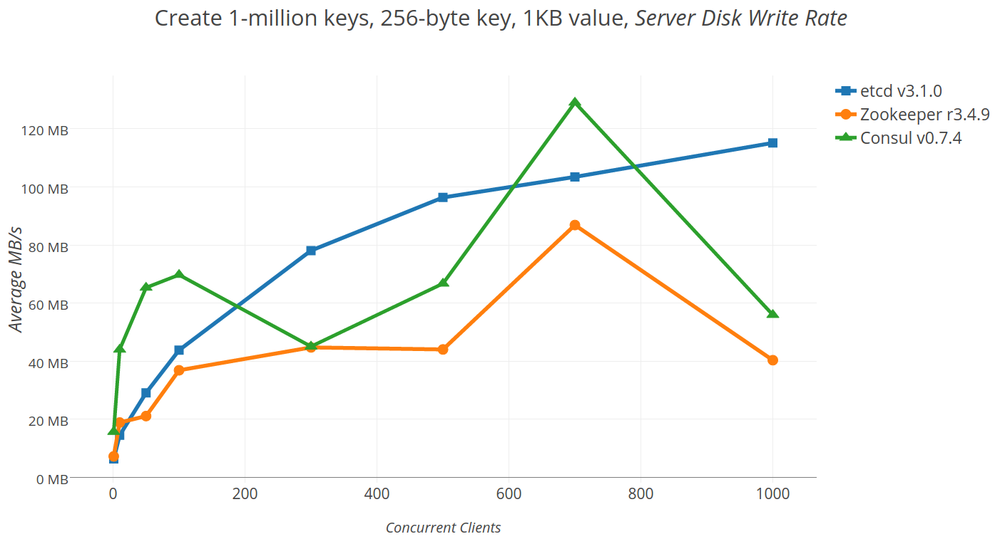
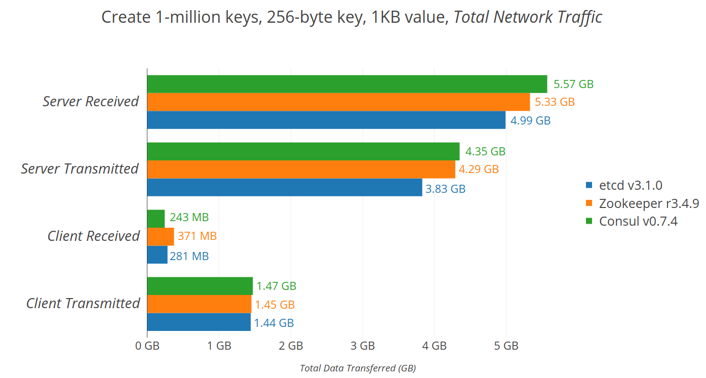
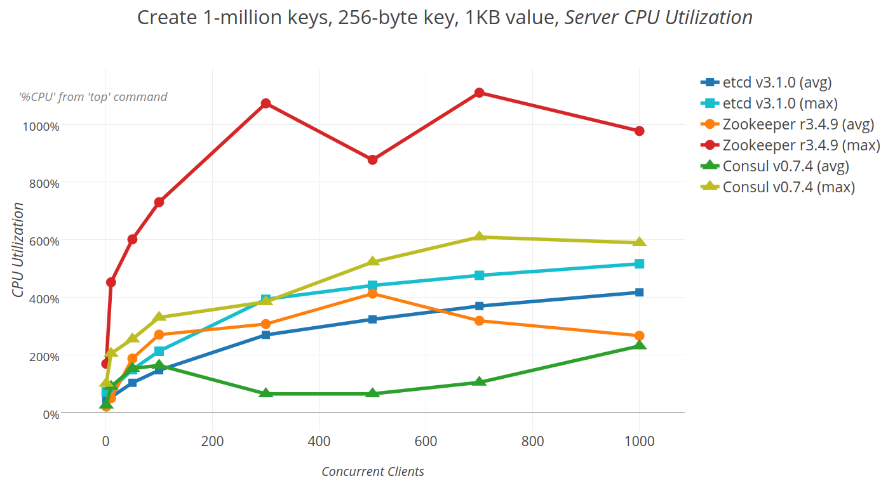
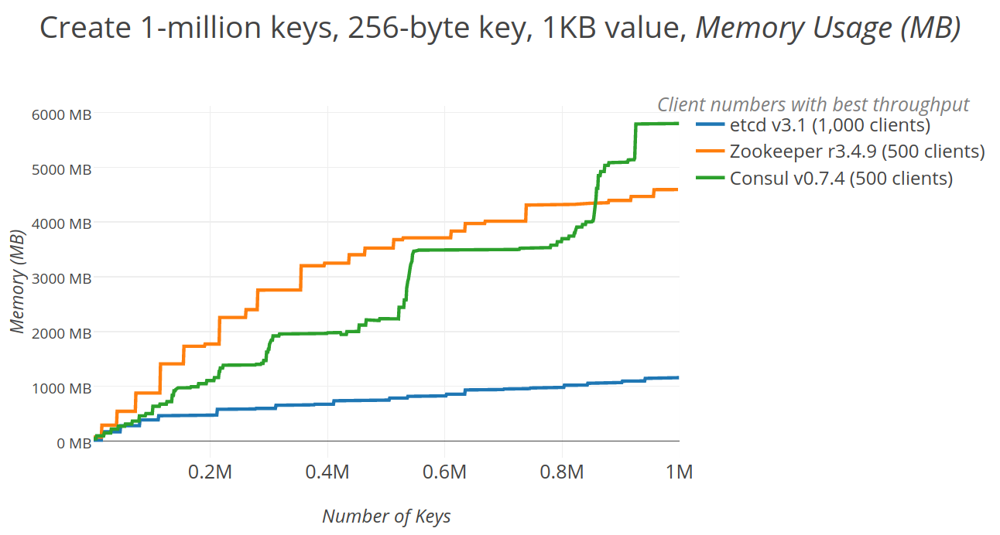
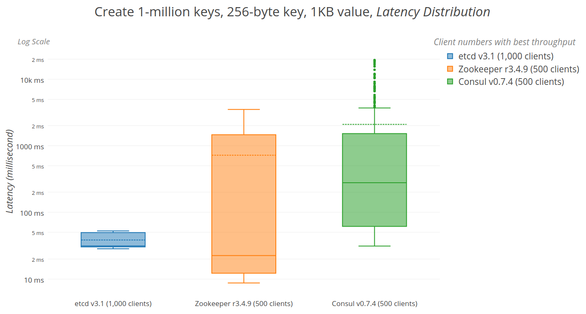

# Morstead etcd Orleans Storage Provider
<div align=center>

&nbsp;&nbsp;&nbsp;&nbsp;&nbsp;&nbsp;&nbsp;&nbsp;&nbsp;&nbsp;&nbsp;
&nbsp;&nbsp;&nbsp;&nbsp;&nbsp;&nbsp;&nbsp;&nbsp;&nbsp;&nbsp;&nbsp;

</div>
<br/>

[](https://www.nuget.org/packages/Orleans.Persistence.Morstead.Etcd/)

## What is it?

A persistent storage provider for Microsoft Orleans that scales on clusters. It is based on etcd. 

etcd is a distributed key value store that provides a reliable way to store data across a cluster of machines. It’s open-source and available on GitHub. etcd gracefully handles leader elections during network partitions and will tolerate machine failure, including the leader.

Your applications can read and write data into etcd. A simple use-case is to store database connection details or feature flags in etcd as key value pairs. These values can be watched, allowing your app to reconfigure itself when they change.

Advanced uses take advantage of the consistency guarantees to implement database leader elections or do distributed locking across a cluster of workers.

etcd has a focus on being:

* Simple: well-defined, user-facing API (gRPC)
* Secure: automatic TLS with optional client cert authentication
* Fast: benchmarked 10,000 writes/sec
* Reliable: properly distributed using Raft

## Status

The current MVP provides the following:

* Single Node etcd, tested using a unittest. It is in early alpha stage but should be usable.

**Grain Persistence**
* ReadStateAsync
* WriteStateAsync
* ~~ClearStateAsync~~ (soon)

The next items that will be worked on in the roadmap (ordered by priority):

* Reminders storage provider
* Cluster storage provider

Items that might be worked on in the future but not on the roadmap:

* Transactions
* Stream providers

This project is open to pull requests.

## Setup

The setup comparable to other orleans storage providers and is build using .NET Standard 2.0.3

### Install nuget package

```
dotnet add package Orleans.Persistence.Morstead.Etcd --version 0.0.1-alpha
```
or visit the nuget for other options on: https://www.nuget.org/packages/Orleans.Persistence.Morstead.Etcd

### Adding the provider to your project

configuration single node (default etcd settings) for development.
```csharp
public void Configure(ISiloBuilder siloBuilder)
{
    siloBuilder
        .AddMorsteadEtcdGrainStorage(name: "storage",options=> {
            // etcd nodes
            options.ConnectionString = "http://localhost:2379";
        });
}
```

configuration example multiple nodes (default etcd settings) for horizontal scale-out.
```csharp
public void Configure(ISiloBuilder siloBuilder)
{
    siloBuilder
        .AddMorsteadEtcdGrainStorage(name: "storage",options=> {
            // etcd nodes
            options.ConnectionString = "https://localhost:23790,https://localhost:23791,https://localhost:23792";
        });
}
```

### Setup an etcd cluster

For testing and development deployments, the quickest and easiest way is to set up a [local cluster](https://etcd.io/docs/v3.1.12/dev-guide/local_cluster/). For a production deployment, refer to the [clustering](https://etcd.io/docs/v3.1.12/op-guide/clustering/) section.

#### Windows setup single node

This package installs etcd as a service, and makes etcdctl (the command line client) available in the path.
The default port when starting etcd is 2379. Note: this is an unsecure setup without CA's.

```
Example: choco install etcd -y"
```

##### Open a Powershell

```powershell
PS C:\ProgramData\etcd> ./etcd
[WARNING] Deprecated '--logger=capnslog' flag is set; use '--logger=zap' flag instead
2020-06-21 11:58:52.465423 I | etcdmain: etcd Version: 3.4.9
2020-06-21 11:58:52.468424 I | etcdmain: Git SHA: 54ba95891
2020-06-21 11:58:52.469422 I | etcdmain: Go Version: go1.12.17
2020-06-21 11:58:52.469422 I | etcdmain: Go OS/Arch: windows/amd64
2020-06-21 11:58:52.469422 I | etcdmain: setting maximum number of CPUs to 12, total number of available CPUs is 12
2020-06-21 11:58:52.470423 N | etcdmain: failed to detect default host (default host not supported on windows_amd64)
2020-06-21 11:58:52.471452 W | etcdmain: no data-dir provided, using default data-dir ./default.etcd
[WARNING] Deprecated '--logger=capnslog' flag is set; use '--logger=zap' flag instead
2020-06-21 11:58:52.478453 I | embed: name = default
2020-06-21 11:58:52.479426 I | embed: data dir = default.etcd
2020-06-21 11:58:52.479426 I | embed: member dir = default.etcd\member
2020-06-21 11:58:52.479426 I | embed: heartbeat = 100ms
2020-06-21 11:58:52.479426 I | embed: election = 1000ms
2020-06-21 11:58:52.481423 I | embed: snapshot count = 100000
2020-06-21 11:58:52.481423 I | embed: advertise client URLs = http://localhost:2379
2020-06-21 11:58:52.494452 I | wal: releasing file lock to rename "default.etcd\\member\\wal.tmp" to "default.etcd\\member\\wal"
2020-06-21 11:58:52.505426 I | etcdserver: starting member 8e9e05c52164694d in cluster cdf818194e3a8c32
raft2020/06/21 11:58:52 INFO: 8e9e05c52164694d switched to configuration voters=()
raft2020/06/21 11:58:52 INFO: 8e9e05c52164694d became follower at term 0
raft2020/06/21 11:58:52 INFO: newRaft 8e9e05c52164694d [peers: [], term: 0, commit: 0, applied: 0, lastindex: 0, lastterm: 0]
raft2020/06/21 11:58:52 INFO: 8e9e05c52164694d became follower at term 1
raft2020/06/21 11:58:52 INFO: 8e9e05c52164694d switched to configuration voters=(10276657743932975437)
2020-06-21 11:58:52.513424 W | auth: simple token is not cryptographically signed
2020-06-21 11:58:52.523424 I | etcdserver: starting server... [version: 3.4.9, cluster version: to_be_decided]
2020-06-21 11:58:52.523424 E | etcdserver: cannot monitor file descriptor usage (cannot get FDUsage on windows)
2020-06-21 11:58:52.524423 I | etcdserver: 8e9e05c52164694d as single-node; fast-forwarding 9 ticks (election ticks 10)
raft2020/06/21 11:58:52 INFO: 8e9e05c52164694d switched to configuration voters=(10276657743932975437)
2020-06-21 11:58:52.525426 I | etcdserver/membership: added member 8e9e05c52164694d [http://localhost:2380] to cluster cdf818194e3a8c32
2020-06-21 11:58:52.525426 I | embed: listening for peers on 127.0.0.1:2380
raft2020/06/21 11:58:53 INFO: 8e9e05c52164694d is starting a new election at term 1
raft2020/06/21 11:58:53 INFO: 8e9e05c52164694d became candidate at term 2
raft2020/06/21 11:58:53 INFO: 8e9e05c52164694d received MsgVoteResp from 8e9e05c52164694d at term 2
raft2020/06/21 11:58:53 INFO: 8e9e05c52164694d became leader at term 2
raft2020/06/21 11:58:53 INFO: raft.node: 8e9e05c52164694d elected leader 8e9e05c52164694d at term 2
2020-06-21 11:58:53.517425 I | etcdserver: setting up the initial cluster version to 3.4
2020-06-21 11:58:53.519428 N | etcdserver/membership: set the initial cluster version to 3.4
2020-06-21 11:58:53.519428 I | embed: ready to serve client requests
2020-06-21 11:58:53.521427 I | etcdserver: published {Name:default ClientURLs:[http://localhost:2379]} to cluster cdf818194e3a8c32
2020-06-21 11:58:53.521427 I | etcdserver/api: enabled capabilities for version 3.4
2020-06-21 11:58:53.521427 N | embed: serving insecure client requests on 127.0.0.1:2379, this is strongly discouraged!
```

## Notes

The configuration options are subject to change in next releases.

## Performance of etcd

Taken from an article from Core.OS, some performance comparisons are available on how etcd measures
up agains Consul and Gatekeeper. 

*Note: The following information is measured in 2017 and taken from source: https://coreos.com/blog/performance-of-etcd.html*

### Disk bandwidth

The chart below shows how scaling client concurrency impacts disk writes.



### Network

The chart below shows total network utilization for all servers and clients. For the most part, etcd has the lowest network usage, aside from Consul clients receiving slightly less data.



### CPU

The graph below shows the server CPU utilization when scaling clients. etcd CPU utilization scales as expected both on average and for maximum load; as more connections are added, CPU load increases in turn.



### Memory

The graph below shows the effect of adding more keys into a cluster on its total memory footprint. Most notably, etcd uses less than half the amount of memory as Zookeeper or Consul once an appreciable number of keys are in the store. 



### Latency distribution

Given the best throughput for the store, the latency should be at a local minima and stable; queuing effects will delay additional concurrent operations. Likewise, ideally latencies would remain low and stable as total keys increases; if requests become unpredictable, there may be cascading timeouts, flapping monitoring alerts, or failures. However, judging by the latency measurements shown below, only etcd has both the lowest average latencies and tight, stable bounds at scale.

